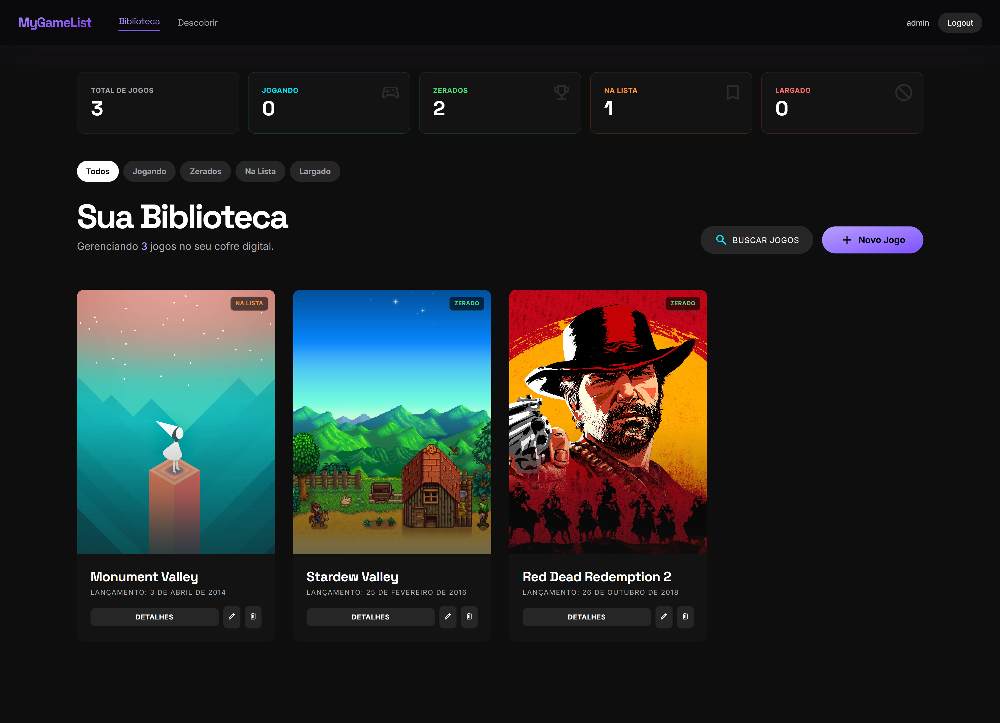
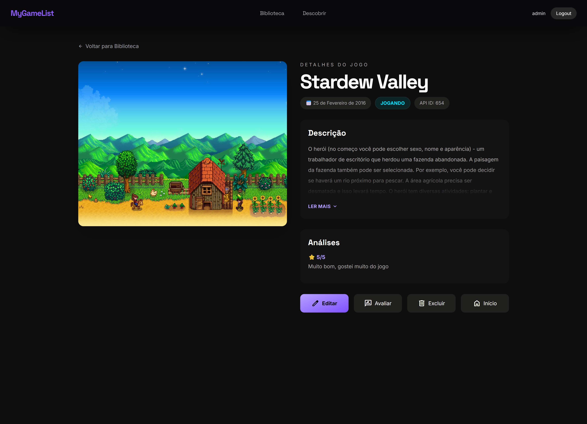

# 🎮 MyGameList


> **Seu cofre digital de jogos.**

Sistema web completo para gerenciamento de biblioteca de jogos pessoais. O **MyGameList** permite que usuários criem suas contas, organizem coleções com status personalizados, avaliem títulos e descubram novos jogos através da integração com a API RAWG, com descrições traduzidas automaticamente para o português.

---

## 🚀 Funcionalidades

*   🔐 **Autenticação Completa**: Sistema de cadastro, login e logout de usuários.
*   📊 **Dashboard Interativo**: Visualização rápida de estatísticas da biblioteca (total de jogos, quantos está jogando, zerados, etc.).
*   🎮 **CRUD Completo**: Gerenciamento total (Criar, Ler, Atualizar, Deletar) de jogos na biblioteca pessoal.
*   🏷️ **Status & Avaliação**: Classifique jogos como *Jogando*, *Zerado*, *Na Lista* ou *Largado* e dê sua nota (1-5 estrelas).
*   📝 **Reviews**: Adicione comentários e análises pessoais aos jogos.
*   🔍 **Busca Inteligente (API RAWG)**: Pesquise metadados reais de jogos e importe-os diretamente para sua biblioteca com imagens e datas oficiais.
*   🌎 **Tradução Automática**: As descrições dos jogos importados da API (em inglês) são traduzidas automaticamente para PT-BR.
*   🎨 **UI/UX Moderna**: Interface responsiva com *Glassmorphism*, modo escuro e filtros dinâmicos sem recarregamento de página.
*   🐳 **Docker Ready**: Configuração completa para rodar com containers (Django + PostgreSQL) com migrações automáticas.

---

## 📸 Screenshots

| Dashboard & Biblioteca | Busca & Importação | Detalhes & Reviews |
|:---:|:---:|:---:|
| |  | |

---

## 🛠 Tecnologias Utilizadas

### Back-end
*   **Python 3.12+**
*   **Django 6.0**: Framework web principal.
*   **Deep Translator**: Biblioteca para tradução automática das descrições.
*   **PostgreSQL**: Banco de dados (produção/docker).
*   **SQLite**: Banco de dados (desenvolvimento local).
*   **Docker & Docker Compose**: Containerização e orquestração.

### Front-end
*   **HTML5 / CSS3**
*   **Tailwind CSS**: Estilização moderna e responsiva.
*   **JavaScript (Vanilla)**: Interatividade no front-end (filtros, estrelas).
*   **Google Fonts & Material Symbols**: Tipografia e ícones.

### Integrações
*   **RAWG API**: Fonte de dados para busca de jogos. ([Obter chave gratuita](https://rawg.io/apidocs))

---

## 🔗 Endpoints (Rotas Principais)

### Jogos (`/`)
| Método | Rota | Descrição |
|:---:|:---|:---|
| `GET` | `/` | Lista de jogos (Biblioteca) e Dashboard. |
| `GET` | `/game/<id>/` | Detalhes de um jogo específico. |
| `GET/POST` | `/create/` | Formulário para adicionar jogo manualmente. |
| `GET/POST` | `/update/<id>/` | Formulário para editar um jogo existente. |
| `GET/POST` | `/delete/<id>/` | Confirmação para excluir um jogo. |
| `GET` | `/search/` | Busca de jogos na API externa. |
| `POST` | `/save-api-game/` | Salva um jogo da API na biblioteca do usuário. |
| `GET/POST` | `/game/<id>/review/` | formulário para adicionar uma avaliação ao jogo. |

### Autenticação (`/accounts/`)
| Método | Rota | Descrição |
|:---:|:---|:---|
| `GET/POST` | `/register/` | Página de criação de conta. |
| `GET/POST` | `/accounts/login/` | Página de login. |
| `POST` | `/accounts/logout/` | Realiza o logout do usuário. |

---

## ⚙️ Instalação e Execução

### Pré-requisitos
*   Git
*   Python 3.10+
*   Docker (Opcional, mas recomendado)

### 1. Clonar e Configurar (.env)

```bash
git clone https://github.com/GuiCodeLabs/wsBackend-Fabrica26.1.git
cd wsBackend-Fabrica26.1
```

---

### 🔹 2. Criar ambiente virtual

```bash
python -m venv venv
venv\Scripts\activate
```

---

### 🔹 3. Instalar dependências

```bash
pip install -r requirements.txt
```

---

### 🔹 4. Configurar variáveis de ambiente

Crie um arquivo `.env` na raiz:

```env
SECRET_KEY=sua_chave_secreta
DEBUG=True
```

---

### 🔹 5. Rodar migrations

```bash
python manage.py migrate
```

---

### 🔹 6. Criar superusuário

```bash
python manage.py createsuperuser
```

---

### 🔹 7. Rodar o servidor

```bash
python manage.py runserver
```

---

## 🐳 Docker

O projeto possui configuração para execução com Docker.

### Arquivos incluídos:

* Dockerfile
* docker-compose.yml

### Executar com Docker:

```bash
docker compose up
```

---

## 🗄 Banco de Dados

O projeto pode utilizar:

* SQLite (padrão do Django)
* PostgreSQL (via Docker ou local)

As tabelas são criadas automaticamente com:

```bash
python manage.py migrate
```

---

## 🔐 Autenticação

O sistema utiliza o sistema de autenticação padrão do Django.

Rotas principais:

* `/accounts/login/`
* `/accounts/logout/`

---

##  Observações

*   **Banco de Dados Híbrido**: O sistema alterna automaticamente entre SQLite (desenvolvimento local) e PostgreSQL (ambiente Docker), facilitando o setup para diferentes níveis de conhecimento técnico.
*   **API Externa**: A busca depende da API da RAWG (plano gratuito), sujeita a limites de requisição.
*   **Interface**: O front-end utiliza Tailwind CSS com design responsivo (Mobile First) e tema escuro nativo, priorizando a experiência do usuário sem frameworks JS pesados.

---

## 👨‍💻 Autor

Desenvolvido por Guilherme Beserra
